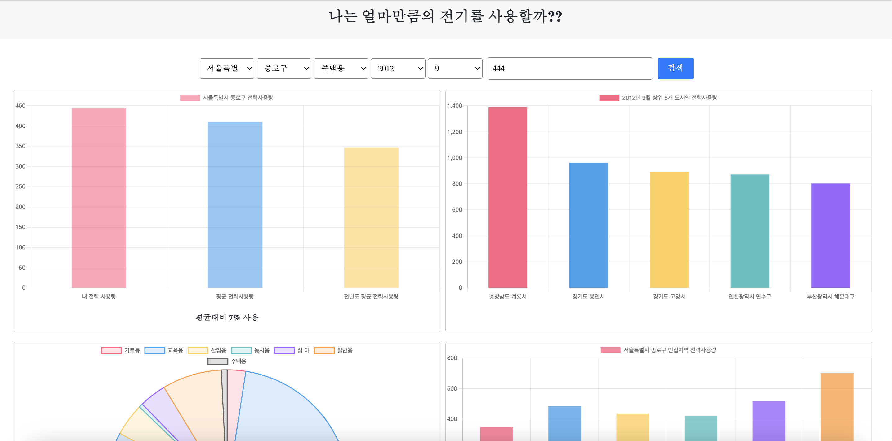

# Getting Started

## Stack
* fastapi
* mongodb
* vuejs
* docker
* gcp


## Prerequisites
- Docker 

## Installation
1. 소스코드 다운로드
    ```shell
    $ git clone https://github.com/power-saver/power.git
    ```
2. 서브 모듈 클론
    ```shell
    $ cd power  
    git clone https://github.com/power-saver/power_app.git
    git clone https://github.com/power-saver/power_front.git
    ```

3. init data load
    ```
    docker exec -it {pythonapp's container id} /bin/bash
    python load.py
    ```

# Usage
- 도커 이미지 빌드 및 컨테이너 실행
    ```shell
    $ docker-compose up --build
    ```
- 컨테이너 실행
    ```shell
    $ docker-compose up
    ```
- 컨테이너 다운
    ```shell
    $ docker-compose down
    ```

# preview 


